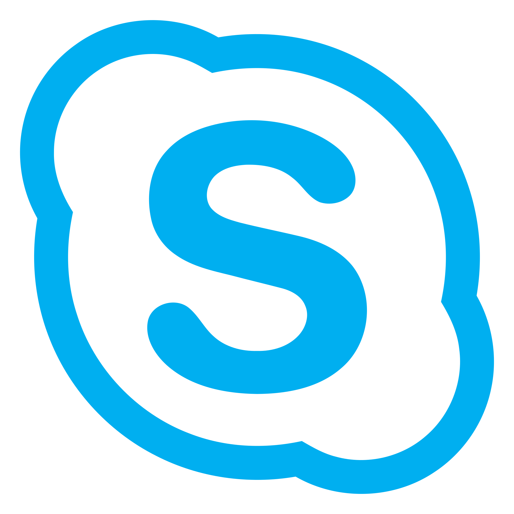
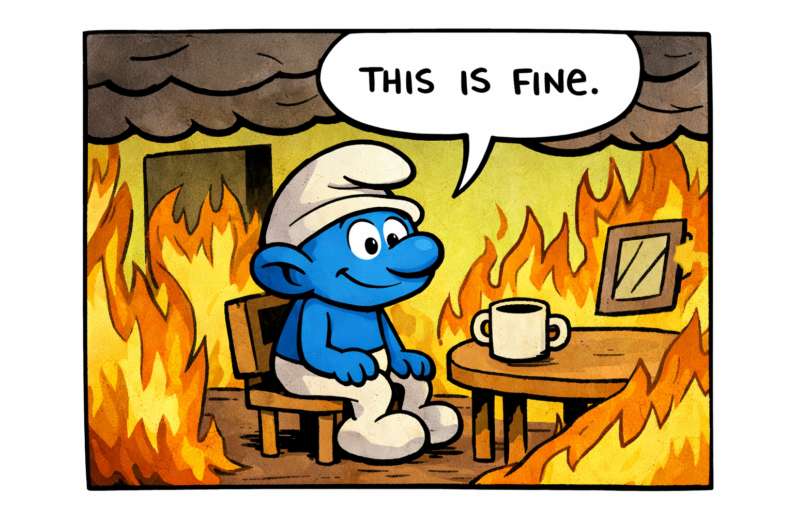

Mom, can we have Mattermost?

Mom: We have Mattermost at home.

The Mattermost at home:

# MiniMost

The two hardest problems in computer science are:

&emsp;~~1. Cache invalidation~~

&emsp;~~2. Naming things~~

1. Communication
2. Convincing others its communication

## FAQ

Is it well written?

> No

Was the core functionality vibe coded in a weekend?

> Maybe

Is it not Skype?

> Yes

## Description 

MiniMost is lightweight, self-host collaboration platform for messaging. The goal of this project is to be dependency light, runnable by users without root, and accessible in the browser.

To launch the server all that is needed is python3 and flask. That's it. For the database sqlite is used meaning no external database is required.

## Advantages over Skype

MiniMost has persistent chat, meaning if you send a message to someone, you can just scroll back to find it. These messages are also editable and much easier to search through. It also has inline images, meaning you don't have to download images to see them in the chat. Since MiniMost uses your browser users are also free to chat on Linux machines rather than needing to run back and fourth between a Linux and Windows machine to do work. MiniMost also doesn't limit your message length, if you want to write a larger message to others you don't need to break it up into several different messages.

The biggest advantage is, we control the source and could make changes we want.

## Advantages of Skype

Skype currently provides the only way to call or screenshare.

## Shortcuts

### Text modifiers

* Ctrl+b to **bold** text.
* Ctrl+i to *italicize* text.
* Ctrl+u to <u>underline</u> text.
* Ctrl+s to ~~strikethrough~~ text.

All text modifiers use markdown syntax[^1]. The modifier can be started and ended with the corresponding hotkeys. Highlighted text can also be modified with the corresponding hotkeys.

[^1]: Except for underlining which is two underscores (__) as markdown somehow actually doesn't natively support underlining and users just need to break out to HTML.

### Images

Images can be attached using the paperclip icon next to the message box but also with Ctrl+v when the image is in your clipboard and by dragging an image over the messagebox.

### Vim motions (some to be implemented)

* j to scroll down (down arrowkey also works).
* k to scroll up (up arrowkey also works).
* G to scroll to bottom of channel.
* g(g) to scroll to top of channel.
* / or f to search messages.
* o to start a new DM.

## Features

- [x] Channels
- [x] Editable messages
- [x] Separate users
- [x] User presence
- [x] Persistent messages
- [x] Message search
- [x] Embedded images 
- [x] Picture previews
- [x] User sign up
- [x] Direct messages
- [x] Group messages
- [ ] Password protected database
- [ ] Password reset 
- [x] Read protected databases 
- [ ] Sort users by most recently messaged 
- [ ] Autocomplete username for new DMs 
- [x] Clickable URLs 
- [x] Bold/Underline/Italic modifiers
- [ ] Typing indicators
- [ ] New message indicators
- [x] Date/time stamps on messages  
- [x] Scrollable sidebar 
- [ ] Bitbucket source previews for links
- [ ] Deletable messages 
- [x] Vim motions
- [ ] Quote reply messages
- [ ] Collapsable sidebar

## Known Bugs/Work Arounds

- [ ]

## Real FAQ

Are my messages secure?

> There is no end to end encryption for messages. Each user gets their own sqlite database to prevent intermixing of messages. These databases are files on the file system and are not encrypted but are not read accessible to all users. There is an additional auth database which stores all users usernames and a sha256 hash of their passwords meaning no passwords are stored plain text.This does mean without a password reset mechanism that any user who forgets their password wouldn't be able to get back into their account.

Does this have all the same features as a chat app like Slack, Discord, or MatterMost?

> Apps like MatterMost have 100+ employees, 4000+
contributors, and over a decade of development. This app was developed by one person on and off over a few weeks, generally while waiting Netflix. Adjust your expectations accordingly.

When was this developed?

> 100% at home, on my own time, free of charge. Driven only out of hatred for Skype and in a desperate attempt to provide a better tool and experience to others.

This is great, but could it also have feature x?

> Yeah! The great part of having the source code for this is that edits can be made! Feel free to create a PR with some proof showing the new feature works and it can be merged and redeployed.Bonus points if you can diff the changes down to the low side as any edits I make would be at home on my own time.

I really want feature x but don't want to put in the time to figure out how to implement it. Can you add it?

> Its more likely to get done if you're able to add the features you want, but if not feel free to add it to the features list in the features sections. It *might* get implemented at some point.

## How to run

To run your server simply:

### Install flask

If using a pip.conf that is configured to point to pypi external Nexus:

`python3 -m pip install --user flask`

If not, manually download the flask wheel and its dependencies and install with:

`python3 -m pip install --user *.whl`

### Running a server

After installing the dependencies, clone and repo and run the following:

`python3 test.py`

This with start a server on [http://127.0.0.1:5000/](http://127.0.0.1:5000/) on the machine you started the server on.

## Footnotes