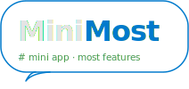

MiniMost Documentation
=======================

|

**MiniMost** is a lightweight, self-hosted chat platform built for private
networks. It runs entirely on Python and SQLite — no external database, no
root access, no infrastructure required. Just Flask and a browser.

.. toctree::
   :maxdepth: 2
   :caption: User Guide

   overview
   installation
   configuration
   deployment
   keyboard_shortcuts
   administration

.. toctree::
   :maxdepth: 2
   :caption: Developer Reference

   architecture
   api_reference
   frontend
   security

.. toctree::
   :maxdepth: 2
   :caption: Python API

   api/index

Indices and tables
==================

* :ref:`genindex`
* :ref:`modindex`
* :ref:`search`
