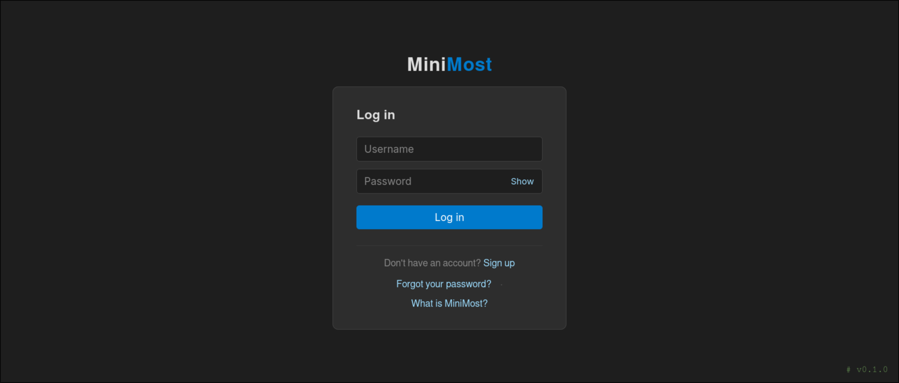
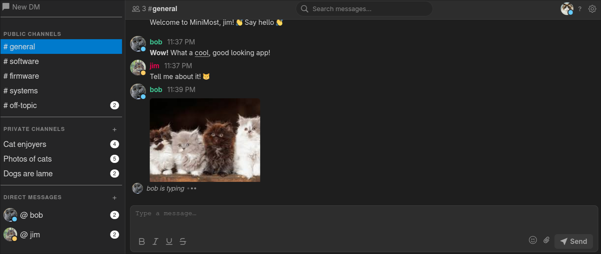
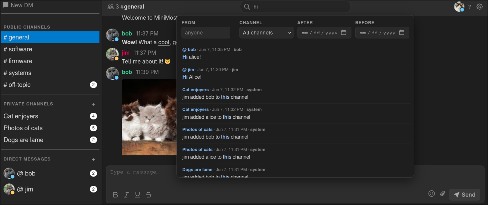

Overview
========

What is MiniMost?
-----------------

MiniMost is a lightweight, self-hosted team chat platform designed for private
networks. It provides a Slack-like chat experience with zero external
dependencies — no PostgreSQL, no Redis, no message broker, no Docker required.
The entire application is a Python package that you can install with ``pip``
and run with a single command.

The design philosophy is intentional minimalism: MiniMost aims to be the
simplest possible thing that actually works for a small team. It will never
compete feature-for-feature with Slack or Mattermost. What it offers is
something those tools cannot: a single self-contained binary equivalent that
runs on any machine with Python 3.6+, stores its data in plain SQLite files
that you can inspect with any SQLite browser, and requires no configuration
to get started.

Screenshots
-----------

   The login page — clean, minimal, and version-tagged.

   The main chat interface — channel list, direct messages, inline image
   attachments, and real-time typing indicators.

   Full-text message search with highlighted results.

Features
--------

Messaging
~~~~~~~~~

- **Public channels** — configurable via ``channels.json``; visible to all
  users.
- **Private channels** — invite-only rooms; members can be added or removed,
  the channel can be renamed (with a system message recording each rename),
  and any member can leave at any time.
- **Direct messages** — private one-on-one or group conversations. DM threads
  can be closed (hidden from the sidebar) with a single click; they
  reappear automatically when a new message arrives.
- **Message history** — persistent and searchable; new users see the full
  public channel history from their first login.
- **Replies & threading** — quote any message to reply in context; the parent
  message is shown inline above the reply.
- **Edit & delete** — users can edit or soft-delete their own messages;
  changes propagate to all recipients in real time.
- **Full-text search** — search across all message content with fuzzy matching
  and highlighted results.
- **Automatic message retention** — a background thread permanently removes
  messages older than a configurable threshold (``message_retention_days``,
  default 770 days) so the database does not grow without bound.

Real-time Interaction
~~~~~~~~~~~~~~~~~~~~~

- **Voice calling** — one-click calls directly in any DM or private channel.
  Audio streams **peer-to-peer over WebRTC** (``RTCPeerConnection``) for
  low-latency, real-time voice; only the call's setup signalling passes through
  the server.  Unanswered calls time out and cancel automatically.
- **Group calling** — any participant in an active call can invite additional
  registered users via an in-call "Add person" button with fuzzy-search.
  Participants join or leave independently; the call ends only when the last
  person leaves.  Group calls form a WebRTC **full mesh** (one peer connection
  per pair).  Avatar tiles reflow dynamically: one caller fills the panel,
  two split 50/50, three or more tile in a grid.  Each tile shows an
  independent speaking-ring animation driven by per-participant voice activity
  detection, and your own microphone button shows a live input-level meter.
- **Screen sharing** — share your screen peer-to-peer over WebRTC, either
  during a call or standalone in any DM/private channel.  Standalone shares are
  viewer-initiated (each viewer offers, the sharer answers with its screen
  track), supporting one sharer to many viewers.
- **LAN-first, zero-config WebRTC** — media never touches the server.  ICE uses
  only host candidates plus a small **bundled STUN server** (``minimost.stun``,
  pure standard library), so peers gather a real-IP server-reflexive candidate
  and connect without any external/public STUN/TURN server and without relying
  on mDNS — it works on fully air-gapped LANs out of the box.
- **Emoji reactions** — react to any message with one of 477 emoji; reactions
  are toggled atomically and sync instantly across all users.
- **@mentions** — typing ``@`` opens a fuzzy-search dropdown of the current
  channel's members (DM participants, private-channel members, or every other
  user for public channels).  Mentions are validated server-side and stored in
  the message's ``mentions`` column; a mentioned user sees the message
  highlighted and receives a sound and desktop notification — honoring their
  notification toggles — even while the page is focused.  The reserved keyword
  ``@everyone`` mentions the whole channel.
- **Typing indicators** — see when other users are composing a message.
- **Read receipts** — checkmark indicators showing who has read each message.
- **Presence indicators** — active, idle, hidden, and offline states updated
  automatically based on tab visibility and user activity; overlaid as a
  small dot on each user's avatar.

Media
~~~~~

- **Image attachments** — paste from clipboard, drag-and-drop, or use the
  paperclip button; supports JPEG, PNG, GIF, and WebP.
- **Link previews** — automatically generated preview cards for URLs, with
  special support for Bitbucket Cloud and Bitbucket Server code file URLs
  (showing the file content with line-number highlighting).
- **Syntax highlighting** — code previews and inline code blocks are
  highlighted for Python, JavaScript, C, shell scripts, and more.

Interface
~~~~~~~~~

- **Single-page application** — the entire chat interface is a zero-framework
  vanilla JavaScript SPA that loads once and polls for updates.
- **User avatars** — every account has a circular avatar showing the user's
  first two initials by default. Users can upload a custom image via the
  Settings menu; images are resized client-side to 128 × 128 px before
  upload. Avatars appear in the DM sidebar, private channel hover tooltips,
  and the member list modal.
- **User settings** — the settings cog (top-right, next to Logout) opens a
  modal for choosing a display name colour from a palette of presets and for
  managing the profile avatar.
- **Dark theme** — easy on the eyes by default.
- **Keyboard shortcuts** — Vim-inspired navigation, formatting shortcuts,
  and quick-access commands; see :doc:`keyboard_shortcuts`.
- **Mobile responsive** — full drawer sidebar, touch-friendly layout, and
  pinch-to-zoom font sizing.
- **Desktop notifications** — browser push notifications when a new message
  arrives and the tab is in the background; an ``@mention`` notifies you even
  while the tab is focused.  Mutable per session.
- **Sound notifications** — configurable audio alerts: new messages, incoming
  calls, call answered, hang-up, and participant-left tones; all mutable with
  one click.  An ``@mention`` plays the new-message alert even when the tab is
  focused.

Security
~~~~~~~~

- Password hashing with PBKDF2 (Werkzeug).
- Enforced password complexity on both frontend and backend.
- 3-second delay on failed login attempts (brute-force protection).
- Channel access control enforced on every read of the shared message store.
- Parameterized SQL queries throughout.
- SSRF protection on link preview fetching (allowlist, private-range block, DNS resolution check).
- SAST scanning with Bandit, Semgrep, CodeQL, and SonarCloud; dependency CVEs audited with pip-audit.

Technical Stack
---------------

.. list-table::
   :header-rows: 1
   :widths: 30 70

   * - Component
     - Technology
   * - Web framework
     - `Flask <https://flask.palletsprojects.com/>`_
   * - Database
     - SQLite (standard library ``sqlite3``)
   * - Password hashing
     - Werkzeug (installed as a Flask dependency)
   * - Frontend
     - Vanilla JavaScript (ES6+), no framework
   * - Styling
     - Plain CSS, dark theme
   * - Templating
     - Jinja2 (Flask default)
   * - Calling media transport
     - WebRTC peer-to-peer (``RTCPeerConnection``); HTTP-polled signalling +
       a bundled stdlib STUN server (no public STUN/TURN)
   * - TLS certificates
     - Auto-generated on first run via system ``openssl`` (self-signed)
   * - Production server
     - Gunicorn (optional, recommended for multi-user deployments)
   * - Python requirement
     - Python 3.6 or later

Project Structure
-----------------

::

    minimost/
    ├── pyproject.toml              # Package metadata and dependencies
    ├── gunicorn.conf.py            # Production WSGI server configuration
    ├── channels.json               # Public channel definitions
    ├── secret.key                  # Auto-generated Flask session secret
    ├── cert.pem                    # Auto-generated TLS certificate (self-signed)
    ├── key.pem                     # Auto-generated TLS private key
    ├── auth.db                     # Shared authentication database
    ├── presence.db                 # Shared real-time state database (incl. call state)
    ├── uploads/                    # Image attachment storage
    ├── avatars/                    # User avatar image storage
    ├── users/                      # Shared message store
    │   └── messages.db             # messages, search index, reactions, read state
    └── src/minimost/
        ├── __init__.py             # Flask app factory
        ├── __main__.py             # CLI entry point
        ├── auth.py                 # Authentication routes & utilities
        ├── calls.py                # Voice/video calling: lifecycle + WebRTC signalling
        ├── stun.py                 # Bundled stdlib STUN server for LAN WebRTC
        ├── chat.py                 # Messaging routes & channel logic
        ├── presence.py             # Presence, typing, reactions
        ├── common.py               # Database path helpers
        ├── database.py             # Schema bootstrap (auth.db)
        ├── preview.py              # Link preview generation
        ├── clean.py                # Retention cleanup (old files and messages)
        ├── templates/
        │   ├── login.html
        │   ├── signup.html
        │   ├── forgot_password.html
        │   └── chat.html           # Main SPA template
        └── static/
            ├── auth.css
            └── styles.css

Limitations and Non-goals
--------------------------

MiniMost is intentionally minimal. The following are explicit non-goals:

- **End-to-end encryption** — messages are stored in plaintext in SQLite
  files. An administrator with filesystem access can read all messages. Treat
  this as an internal LAN tool, not a secure messenger.
- **Self-service password reset** — there is no email-based reset flow.
  An administrator generates a one-time reset URL via the CLI; the user
  cannot initiate a reset themselves.
- **Role-based access control** — all registered users have the same
  permissions; there are no admin accounts, channel moderation roles, or
  invite-only channels.
- **Federation or multi-server** — MiniMost is a single-server application
  with no inter-server protocol.
- **Webhooks or integrations** — there is no bot API or incoming webhook
  support in the current version.

FAQ
---

**How many users can it support?**

MiniMost is designed for small teams — typically 2–50 users on a local
network. SQLite performs well for this workload, especially with WAL mode
enabled. For larger deployments, Gunicorn with multiple workers is
recommended.

**What happens to messages if the server restarts?**

Nothing — all messages are durably written to SQLite before the route
handler returns. The only state lost on restart is the in-process link
preview cache (``preview.py``).

**Can I back up the data?**

Yes. The entire state of the application lives in:

- ``auth.db`` — credentials and user settings (name colour, avatar filename)
- ``presence.db`` — presence, typing, private-channel membership, and call state
- ``users/messages.db`` — all messages, the search index, reactions, and read state
- ``uploads/`` — image attachments
- ``avatars/`` — user profile avatar images

A simple filesystem backup of the project directory is sufficient.
